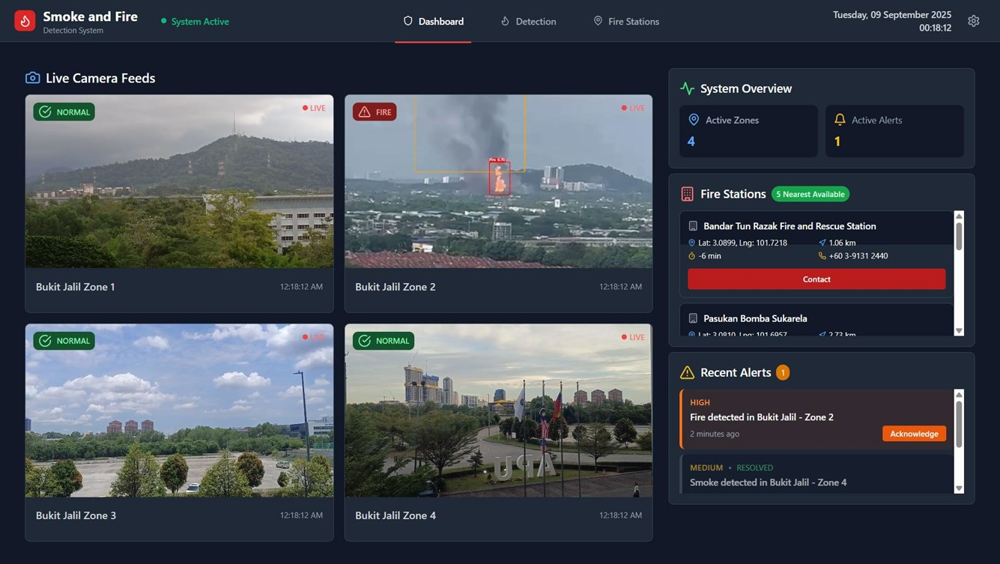
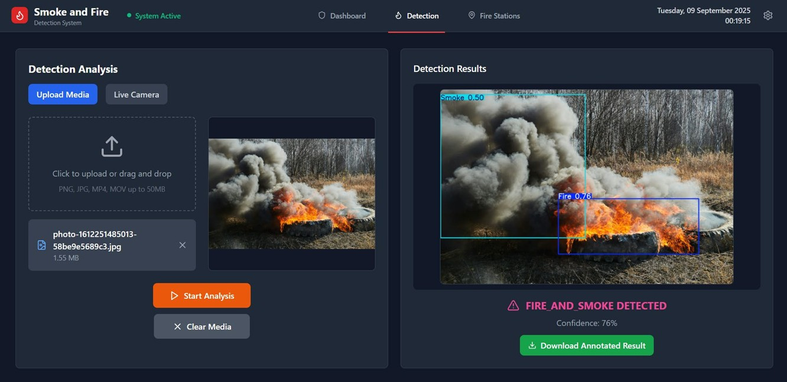
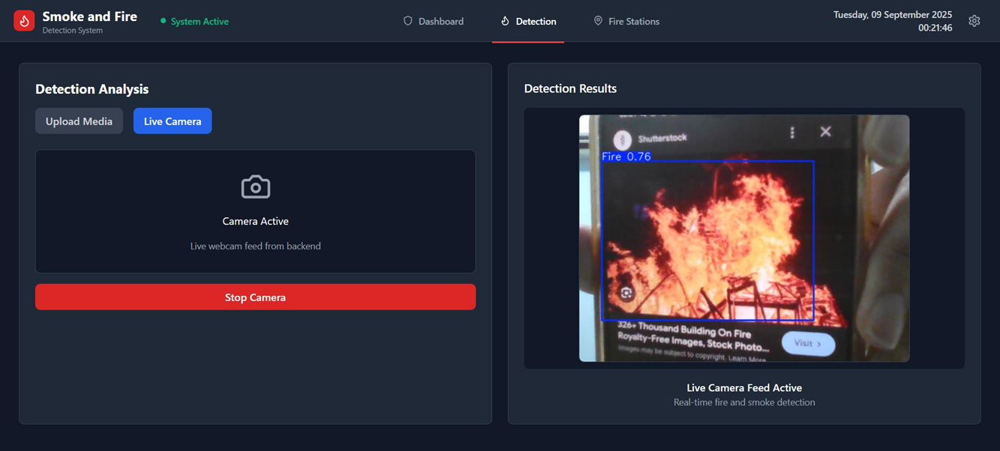
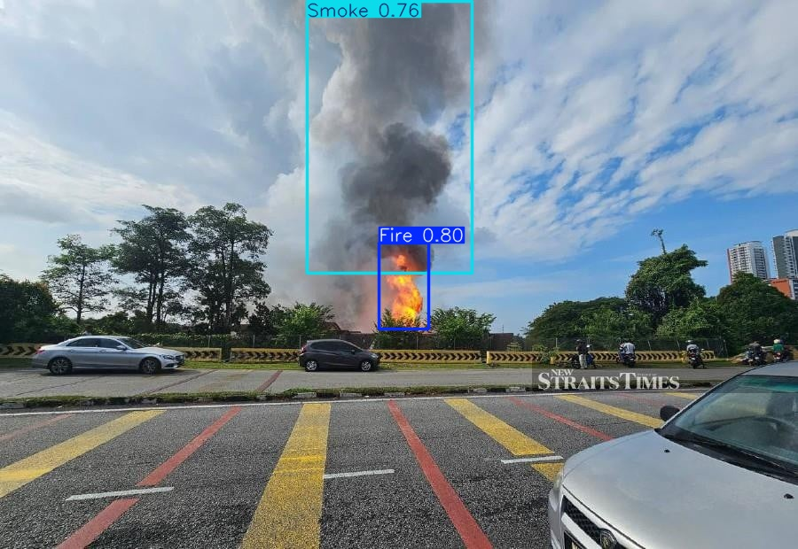
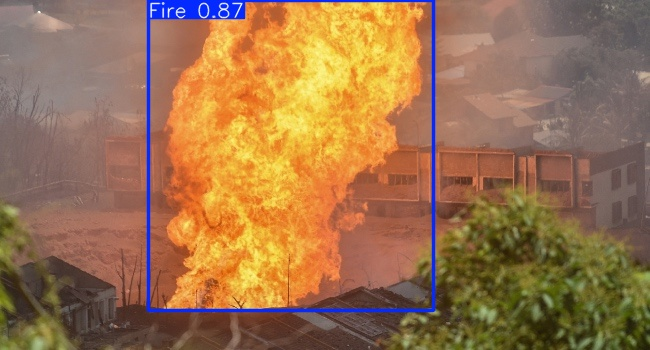

# 🔥 Smoke and Fire Detection System (SAFDS)

A web-based interface designed to **detect smoke and fire** with an integrated automatic alert and emergency response system, to effectively minimize the effects of fire on biodiversity, air quality, and human health. This project leverages **deep learning models**, **computer vision**, **geolocation services**, and **real-time monitoring** to assist in early wildfire and fire incident detection.

---

## 🚀 Overview

**SAFDS** is built to simulate a full-scale fire detection and response monitoring system.
It allows users to:

* Monitor multiple surveillance feeds.
* Test the system using images, videos, or a live camera.
* Display the nearest fire stations based on real-time location data.

---

## 🔐 Login Credentials

| Email             | Password   |
| ----------------- | ---------- |
| `admin@safds.com` | `admin123` |

> Use these credentials to explore the system’s full functionality.

---

## 🧭 System Features

### 1. **Monitor Surveillance Dashboard**

A simulated live monitoring interface showcasing how SAFDS would operate in real deployment.

* Four live camera feeds for smoke/fire detection that displayed processed videos
* System status and overview metrics.
* Nearby fire stations listing.
* Real-time alerts panel for recent detections.



---

### 2. **Test Smoke and Fire Detection**

Users can upload or stream data to test SAFDS’s detection capability.

* Upload **images** or **videos**, or open **live camera feed**.
* Processed using **trained YOLOv11m** model.
* Displays:

  * **Detection results** with bounding boxes.
  * **Confidence scores** for each detection.
* Option to **download annotated results** for analysis or reporting.

<p align="center">
  
  
</p>

---

### 3. **View Fire Stations Map**

A geospatial feature that shows the **five nearest fire stations** based on the user’s current location.

* Powered by **Google KML data**.
* Interactive map with clickable placemarks.
* Each placemark reveals:

  * Fire station **name**
  * **Latitude** and **Longitude**
  * **Distance** and **Estimated Time of Arrival (ETA)**
  * **Contact number**


---

## 🧠 Model Development

The detection models were trained using data annotated on **[Roboflow](https://app.roboflow.com/hi-qepkw/smoke-and-fire-detection-ay6ym/5)**.
Various YOLO architectures were evaluated in **Google Colab** for performance and accuracy:


| Model    | Environment  | Purpose                                         |
| -------- | ------------ | ----------------------------------------------- |
| YOLOv5m  | Google Colab | Baseline performance                            |
| YOLOv8m  | Google Colab | Improved accuracy                               |
| YOLOv11m | Google Colab | Final deployed model (best precision and speed) |
> For more information can browse to [Model Training](model_training) folder
---

## 🧩 Tech Stack

| Component           | Framework / Language         |
| ------------------- | ---------------------------- |
| **Frontend**        | React.js (with TypeScript)   |
| **Backend**         | FastAPI                      |
| **Language**        | Python                       |
| **AI Models**       | YOLOv5m / YOLOv8m / YOLOv11m |
| **Annotation Tool** | Roboflow                     |
| **Map Integration** | Google KML                   |

---

## 🧰 Prerequisites

Before running the **Smoke and Fire Detection System (SAFDS)**, ensure that both software and hardware meet the following minimum requirements.

---

### 💽 Software Specifications

| Component                       | Description                                                                                  |
| ------------------------------- | -------------------------------------------------------------------------------------------- |
| **IDE / Code Editor**           | [Visual Studio Code](https://code.visualstudio.com/) or any preferred IDE                    |
| **Frontend Framework**          | [React.js](https://react.dev/) (TypeScript supported)                                        |
| **Backend Framework**           | [FastAPI](https://fastapi.tiangolo.com/)                                                     |
| **Programming Language**        | [Python 3.9+](https://www.python.org/downloads/)                                             |
| **Annotation Tool**             | [Roboflow](https://roboflow.com/) – for dataset labeling and preprocessing                   |
| **Model Training Environment**  | [Google Colab](https://colab.research.google.com/)                                           |
| **Model Management (Optional)** | [Ultralytics HUB](https://hub.ultralytics.com/)                                              |
| **Environment Management**      | [Anaconda](https://www.anaconda.com/) – for managing virtual environments (`conda activate`) |

> 💡 **Note:** Make sure Node.js and npm are installed to run the React frontend.

---

### 🖥️ Hardware Specifications

| Component               | Specification         |
| ----------------------- | --------------------- |
| **Processor (CPU)**     | Intel Core i5-12450HX |
| **Graphics Card (GPU)** | NVIDIA RTX 3050 6GB   |

> ⚙️ These specifications ensure smooth performance for model inference, video processing, and system simulation.

---

## ⚙️ Installation & Setup

### 🟢 First-Time Setup

1. **Clone the repository**

```bash
git clone https://github.com/jinhui321/safds.git
cd safds
```

2. **Backend Setup (FastAPI)**

```bash
cd backend
conda create --name VirEnv python==3.10
conda activate VirEnv
pip install -r requirements.txt
```

3. **Frontend Setup (React.js + TypeScript)**

```bash
npm install
```

---

### 🟢 Running SAFDS After Installation

1. **Start the Backend**

```bash
cd backend
conda activate VirEnv
uvicorn main:app --reload
```

2. **Start the Frontend**

```bash
npm run dev
```

3. **Access the App**

* Open your browser and go to: `http://localhost:3000`
* Login with the admin credentials:

```
Email: admin@safds.com
Password: admin123
```
---

## 📸 Sample Output
<p align="center">
  
  
</p>

> For more results, can browse in [Results](backend/results) folder
---

## 📍 Future Enhancements

* **Model Enhancement:** Fine-tune the YOLOv11m model for better detection of small or distant fires by adding small-object layers and optimizing anchor sizes.
* **Dataset Expansion:** Include more smoke and fire images under varied conditions (night, low-contrast, long-distance) and apply augmentation for dynamic smoke patterns.
* **Hardware Upgrade:** Use stronger GPUs or edge devices to support multiple live feeds and enable real-time detection without delay.
* **Enhanced Alerting:** Add a public alert feature to send SMS notifications after incident confirmation and include fire severity analysis (low, medium, high).
* **Other Enhancements:** Real-time alert integration via SMS/Telegram, integration with government fire emergency APIs, automated drone-based monitoring, cloud-based model deployment, and multi-camera synchronization.

---

## 🧾 Acknowledgements

* **Supervisor and Second Marker** for their support.
* **Roboflow** for dataset annotation and preprocessing.
* **Ultralytics YOLO** for state-of-the-art object detection models.
* **Google Maps & KML** for geolocation and mapping services.
* **FastAPI** and **React.js** for the full-stack web application framework.

---

## 📧 Contact

**Developer:** Voon Jin Hui  
**Email:** tfany123.tv@gmail.com  
**LinkedIn:** https://www.linkedin.com/in/voon-jin-hui-56bb95162/

---
